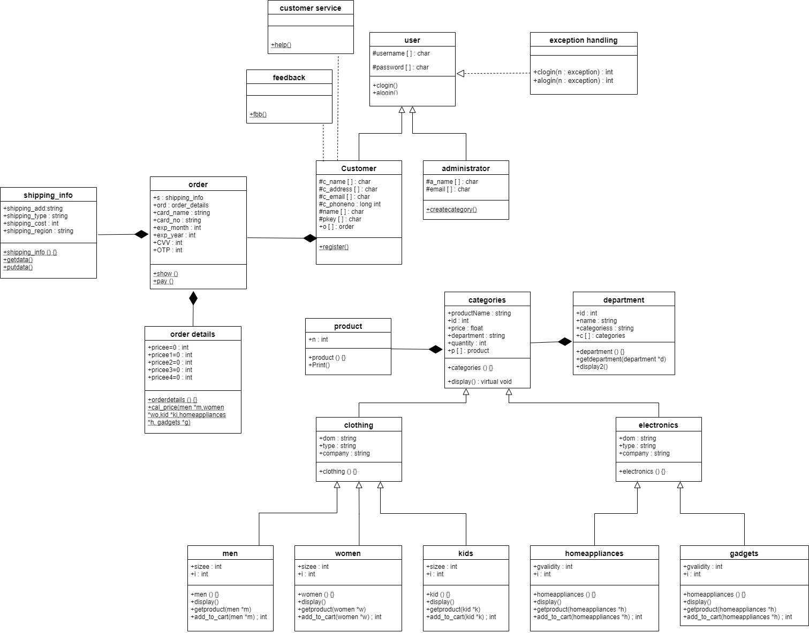

# Online-Shopping-System--C++

## 📌 Problem Statement  
This project aims to develop an **online shopping system** that enables customers to shop conveniently from their homes. Both **customers** and **administrators** require a username and password to log in.  

- **Administrator**: Can create categories and products, as well as handle customer service.  
- **Customer**: Can browse and purchase products from two main departments: **Electronics** and **Clothing**.  
- **Payment Options**: Net Banking, EMI, and Cash on Delivery (COD).  

The system ensures security with login validation and exception handling, provides shipping details upon order confirmation, and maintains a user-friendly shopping experience.  

---

## 🚀 Features of Application  

### 1. Customer & Administrator Login  
- Existing users log in with **unique username and password**.  
- New customers must **register** before shopping.  

### 2. Customer Functionality  
- Browse products from:  
  - **Clothing** → Men, Women, Kids  
  - **Electronics** → Home Appliances, Gadgets  
- Confirm orders, make payment, and receive **shipping details**.  
- Provide **feedback** and access **customer service**.  

### 3. Administrator Functionality  
- Create new **categories** and **products**.  
- Handle **customer queries/issues** via customer service.  

---

## Class Diagram

---

## 🏗️ Class Descriptions  

### 🔹 `User` (Abstract Class)  
- Attributes: `username`, `password`  
- Methods: `clogin()`, `alogin()` for login validation  

### 🔹 `Customer` (Child of User)  
- Attributes: `c_name`, `c_address`, `c_email`, `c_phone`, `pkey`  
- Methods: `register1()`, give feedback, access customer service  

### 🔹 `Administrator` (Child of User)  
- Attributes: `a_name`, `email`, `c_id`, `d_id`, `c_name`, `c_desc`  
- Methods: `createcategory()` to manage system categories  

### 🔹 `Exception Handling`  
- Handles **invalid login attempts** for customers/admins  

### 🔹 `Department`  
- Attributes: `id`, `name`, `categories`  
- Methods: `getdepartment()`, `display2()`  

### 🔹 `Category` (Abstract Class)  
- Attributes: `product_name`, `id`, `price`, `department`, `quantity`  
- Methods: `display()` (virtual)  

### 🔹 `Clothing` (Child of Category)  
- Attributes: `dom`, `type`, `company`  

### 🔹 `Electronics` (Child of Category)  
- Attributes: `dom`, `type`, `company`  

### 🔹 `Product`  
- Displays all products available in the system  

### 🔹 `Men`, `Women`, `Kids` (Children of Clothing)  
- Methods: `display()` (overridden), `getproduct()`, `add_to_cart()`  
- Attributes: `size`, `i`  

### 🔹 `Home Appliances`, `Gadgets` (Children of Electronics)  
- Methods: `display()` (overridden), `getproduct()`, `add_to_cart()`  
- Attributes: `gvalidity`, `i`  

### 🔹 `Order`  
- Attributes: Shipping info & order details (composition)  
- Methods: `show()`, `pay()`  

### 🔹 `OrderDetails`  
- Method: `cal_price()` to calculate total order price  

### 🔹 `ShippingInfo`  
- Methods: `getdata()`, `putdata()`  

### 🔹 `CustomerService`  
- Provides assistance with queries/issues  

### 🔹 `Feedback`  
- Records customer feedback  

---

## 🖥️ Main Function  
- Creates objects of `User`, `Customer`, `Administrator`, `Product`, `CustomerService`, and `Feedback`.  
- Creates **two Department objects** and objects of Men, Women, and Kids.  
- Provides a **menu-driven interface** with options:  
  - Login as Customer/Admin  
  - Register as new Customer  
  - Shop and add products to cart  
  - Pay and confirm order  

---

## 🎯 Use of Standard Design Patterns  

### 🔹 Factory Method Pattern (Creational)  
- **Definition**: Provides a runtime interface for object creation without specifying exact class.  
- **Usage**: Used for creating product objects dynamically at runtime.  

### 🔹 Template Method Pattern (Behavioral)  
- **Definition**: Abstract class defines a template, subclasses override method implementations.  
- **Usage**: `display()` function of `Category` is overridden by Men, Women, Kids, Home Appliances, and Gadgets.  

---

## ✅ Summary  
This project demonstrates the design and implementation of a **secure, extensible, and user-friendly online shopping system**. It leverages **OOP concepts** like inheritance, abstraction, composition, and exception handling, while also applying **design patterns** (Factory & Template) to ensure scalability and maintainability.  
